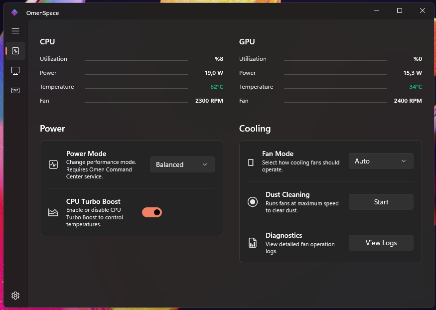
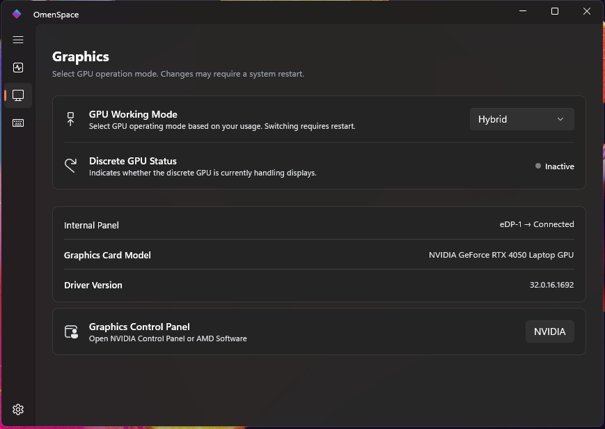
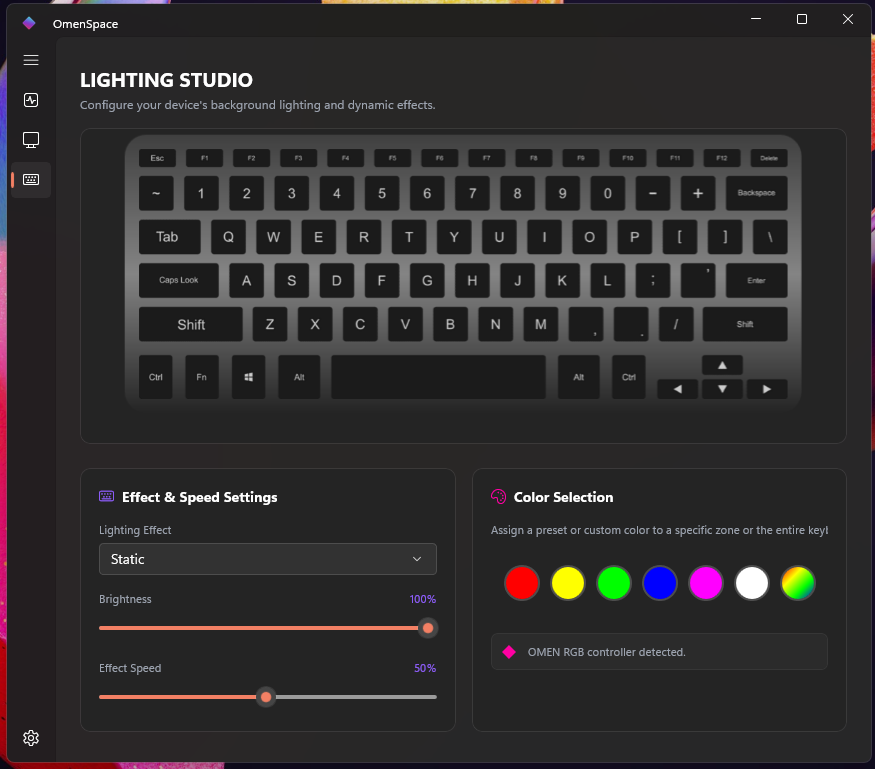

<div align="center">
  <h1>OmenSpace for Windows</h1>
  
  <p>A lightweight, modern, and open-source control center for HP OMEN and Victus laptops.</p>
</div>

<br />

**OmenSpace** is designed as a fast, bloat-free alternative to the official HP OMEN Gaming Hub. Built with WPF and modern UI aesthetics, it gives you complete control over your laptop's performance, cooling, and lighting without consuming unnecessary system resources.

## ✨ Features

*   🚀 **Performance Control:** Seamlessly switch between Default, Performance, and Eco power modes.
*   ❄️ **Advanced Fan Management:** Create your own custom fan curves or use predefined modes (Auto / Max).
*   💻 **GPU Mux Switch:** Toggle between Hybrid (Advanced Optimus) and Discrete GPU modes on supported hardware.
*   🌈 **Keyboard Lighting:** Built-in support for Standard, Four-Zone, and modern Per-Key RGB lighting (utilizing Windows Dynamic Lighting / LampArray).
*   🧠 **Smart Hardware Detection:** Dynamically recognizes 40+ OMEN and Victus device models (including the Transcend series) and tailors the UI to your specific hardware capabilities.

## 📸 Screenshots

 Performance & Custom Fan Curves 
  
 
 GPU Mode 
 
 
 
 Lighting Settings 
 


## 🚀 Installation & Build

### Requirements
- Windows 10/11 (64-bit)
- [.NET 10.0 SDK](https://dotnet.microsoft.com/)

### Building from Source
1. Clone the repository:
   ```bash
   git clone https://github.com/your-username/omen-space-windows.git
   ```
2. Navigate to the project root and build the solution:
   ```bash
   cd omen-space-windows
   dotnet build
   ```
3. Run the application:
   You can start the app directly using the provided `RunOmenSpace.bat` script which ensures the worker service and UI launch correctly.

## 🤝 Acknowledgements (Atıflar)

This project stands on the shoulders of giants. We express our deepest gratitude to the creators, reverse-engineers, and contributors of the following open-source projects for making this possible:

*   **[omenmon](https://github.com/OmenMon/OmenMon)** - For pioneering the research into HP's WMI and EC (Embedded Controller) fan control interfaces.
*   **[omenmon-reborn](https://github.com/seakyy/OmenMon-Reborn)** - For keeping the legacy alive and continually expanding the list of supported devices.
*   **[omencore](https://github.com/theantipopau/omencore)** (and the Linux `omen-space` project) - For their incredibly comprehensive hardware capability databases, which served as the foundation for OmenSpace's modern device recognition and LampArray implementations.

## 📜 License
This project is open-source. (See LICENSE for more details).
